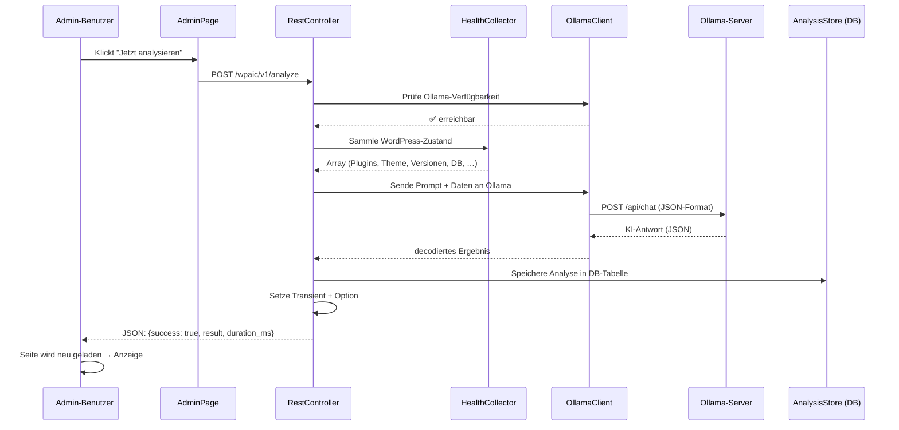
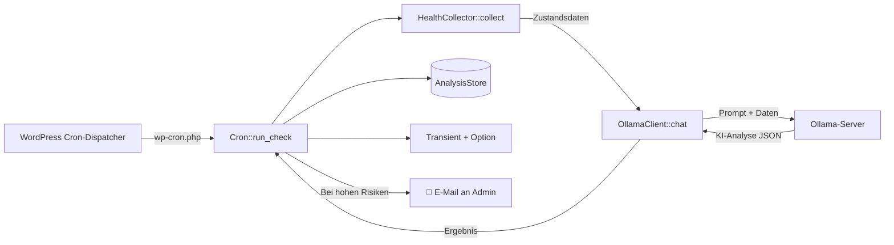
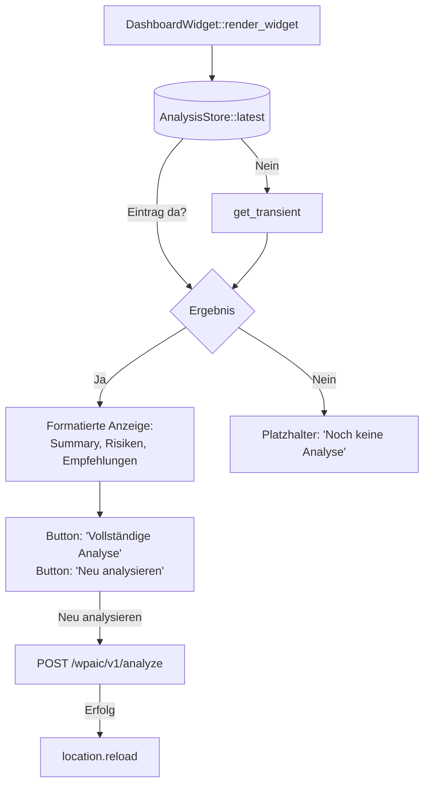
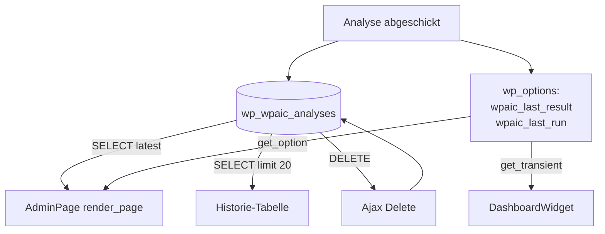

# WP AI Health Check – Programmablauf (Mermaid)

## Hauptablauf: Analyse starten



## Automatischer Cron-Job (täglich)



## Dashboard-Widget-Ladung



## Datenpersistenz-Übersicht



## Tabellen-Schema

```mermaid
erDiagram
    wp_wpaic_analyses {
        bigint id PK auto-increment
        datetime run_at
        varchar model
        int duration_ms
        varchar status
        text error_message
        longtext result_json
    }
```
