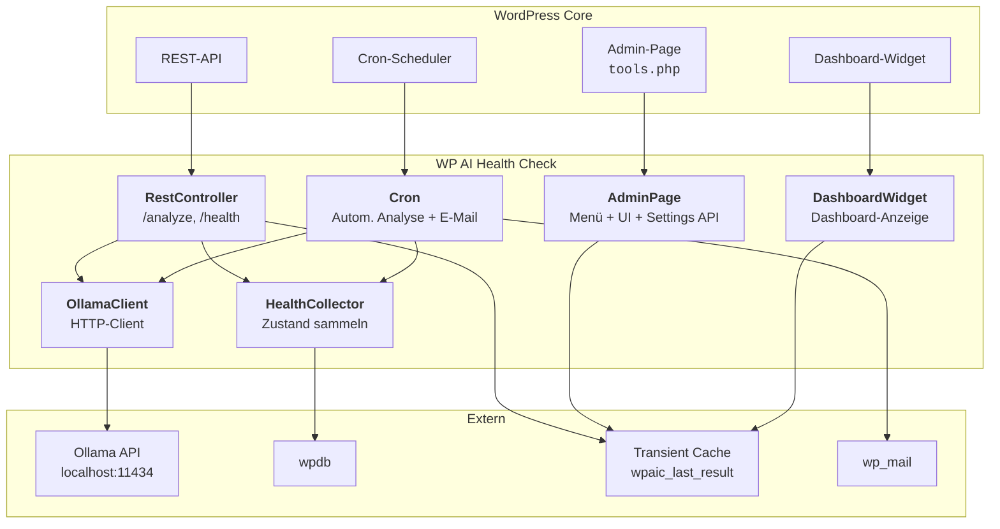
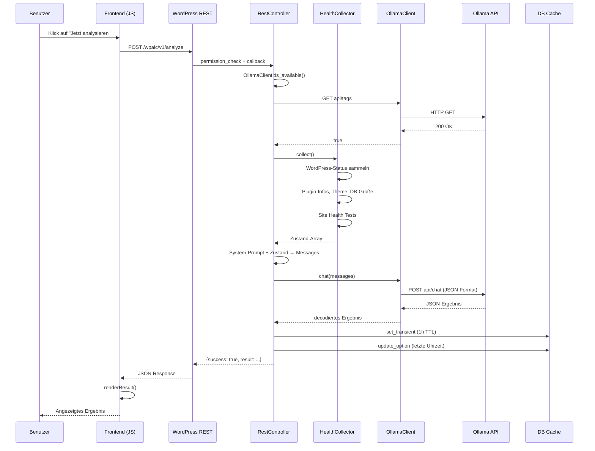
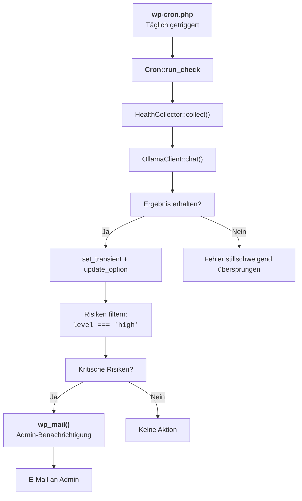
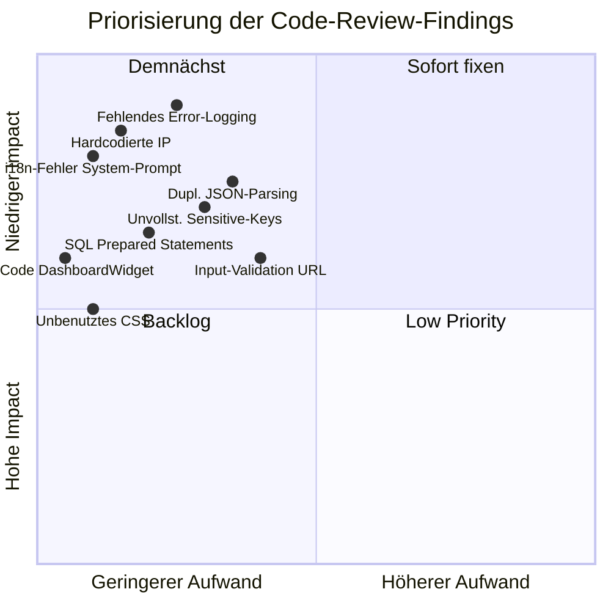

# 🧐 Code-Review: WP AI Health Check

**Plugin:** WP AI Health Check v0.2.0  
**Review-Datum:** 2025-07-23  
**Reviewer:** AI Code Review Agent  

---

## 1. Architektur-Übersicht

### 1.1 Komponentendiagram



### 1.2 Datenfluss bei manueller Analyse



### 1.3 Cron-Flow (automatische Analyse)



---

## 2. Klassen-Abhängigkeiten

```mermaid
graph LR
    AdminPage["AdminPage"] -->|"register_hooks" --> Cron
    AdminPage -->|"OllamaClient::get_models()" --> OC["OllamaClient"]
    DashWidget["DashboardWidget"] -.->|"get_transient" .-> RC["RestController"]
    RC --> OC
    RC --> HC["HealthCollector"]
    Cron --> HC
    Cron --> OC
    AdminPage -->|"settings_fields" --> WP["Settings API"]
    RC -->|"permission_callback" --> WP
```

---

## 3. Kritische Findings

### 🔴 KRITISCH — Hardcodierte IP-Adresse

**Datei:** `includes/ClassOllamaClient.php` (Zeile 14) und `includes/ClassAdminPage.php` (Zeile 30)

```php
// ClassOllamaClient.php:14
$host = trailingslashit( get_option( 'wpaic_ollama_host', 'http://192.168.0.194:11434' ) );

// ClassAdminPage.php:30
'default' => 'http://192.168.0.194:11434',
```

**Problem:** Die IP `192.168.0.194` ist eine fixe LAN-Adresse. Das Plugin wird auf jedem anderen System nicht funktionieren.

**Empfehlung:** Nutze `http://localhost:11434` als Default oder lass den Default leer (`''`), damit der User gezwungen wird, eine URL einzutragen.

---

### 🔴 KRITISCH — SQL-Statement ohne Prepared Statements

**Datei:** `includes/ClassHealthCollector.php` (Zeile 37)

```php
'options_count' => (int) $wpdb->get_var( "SELECT COUNT(*) FROM {$wpdb->options}" ),
```

**Problem:** `$wpdb->options` ist zwar eine interne Konstante und kein nutzerkontrollierter Wert, aber die WordPress-Best-Practice ist die Nutzung von `$wpdb->prepare()` oder `$wpdb->get_var( $wpdb->prepare(...) )`.

**Empfehlung:**
```php
$options_count = $wpdb->get_var( $wpdb->prepare( "SELECT COUNT(*) FROM %i", $wpdb->options ) );
```

---

### 🟠 HOCH — Duplizierte JSON-Parsing-Logik

**Dateien:** `ClassAdminPage.php` (Zeilen 54–115) und `ClassDashboardWidget.php` (Zeilen 57–79)

Die Logik zum Extrahieren von JSON aus Markdown-gekennzeichnetem Ollama-Output ist in **zwei Dateien** fast identisch implementiert. Die AdminPage-Version ist sogar umfangreicher mit Fallstricken-Reparatur.

**Problem:**
- Bugfixes müssen an zwei Stellen übernommen werden
- Inkonsistenz zwischen den Ausgaben (AdminPage zeigt Debug-Info, Widget nicht)
- Verstoß gegen DRY-Prinzip

**Empfehlung:** Eine statische Hilfsmethode in `OllamaClient` oder eine neue `JsonParser`-Klasse:
```php
public static function parse_json_response( string $raw ): ?array
```

---

### 🟠 HOCH — Fehlendes Error-Logging

**Datei:** `includes/ClassCron.php` (Zeilen 45–46)

```php
$ai = OllamaClient::chat( $messages );
if ( ! is_wp_error( $ai ) ) {
    // ... Erfolgsfall
}
// WP_Error wird einfach ignoriert!
```

**Problem:** Wenn Ollama im Cron-Fall fehlschlägt (z.B. Netzwerk, Timeout), passiert **nichts** — kein Log-Eintrag, kein Alert, kein User-Feedback. Der Admin weiß nicht, dass die automatische Analyse fehlgeschlagen ist.

**Empfehlung:**
```php
if ( is_wp_error( $ai ) ) {
    error_log( sprintf(
        '[WP AI Health Check] Cron-Fehler: %s',
        $ai->get_error_message()
    ) );
}
```

---

### 🟡 MITTEL — Unvollständige Sensitive-Key-Liste

**Datei:** `includes/ClassHealthCollector.php` (Zeilen 11–14)

```php
private static array $sensitive_keys = array(
    'password', 'passwd', 'secret', 'key', 'token',
    'auth', 'credential', 'private', 'api_key', 'apikey'
);
```

**Problem:**
- `'key'` ist zu allgemein — filtert u.U. nicht-sensible Keys wie `option_name`, `meta_key`
- Fehlende Muster: `salt`, `nonce`, `hash`, `cipher`, `signat`, `secret_key`
- `api_key` und `apikey` sind redundant (beide matchen auf `api_key`)

**Empfehlung:** Präzise Liste mit expliziten Matches:
```php
'sensitive_keys' => array( 'password', 'passwd', 'secret', 'salt', 'nonce', 
    'api_key', 'api_secret', 'private_key', 'auth_token', 'access_token' )
```

---

### 🟡 MITTEL — Tot Code in DashboardWidget

**Datei:** `includes/ClassDashboardWidget.php` (Zeilen 242–255)

```php
private function fetch_latest_result(): ?array {
    // ... wird nirgendwo aufgerufen!
}
```

**Problem:** 14 Zeilen toter Code erhöhen die Wartungskosten und verwirren bei der Code-Lektüre.

**Empfehlung:** Entfernen oder als `@internal` markieren.

---

### 🟡 MITTEL — Unbenutzte CSS-Klassen

**Datei:** `assets/admin.css` (Zeilen 70–173)

Klassen wie `.wpaic-result-summary`, `.wpaic-risk-list`, `.wpaic-risk-item`, `.wpaic-recommendations` werden **niemals im PHP/JS gerendert**. Der PHP-Code nutzt durchgängig Inline-Styles.

**Empfehlung:** Entweder die CSS-Klassen im PHP nutzen ODER die unbenutzten CSS-Regeln löschen.

---

### 🟡 MITTEL — Kein Input-Validation für Ollama-URL

**Datei:** `includes/ClassAdminPage.php` (Zeile 29)

```php
'sanitize_callback' => 'esc_url_raw',
```

`esc_url_raw` validiert das Protokoll, Host und Port, akzeptiert aber keine URLs mit Pfad oder Query-Params. Das ist akzeptabel für die Ollama-URL, aber es gibt **keine Runtime-Validation** in `OllamaClient` — eine manipulierte Option könnte `wp_remote_get()` mit einer ungültigen URL aufrufen.

---

### 🟡 MITTEL — Inkonsequente i18n-Wrapung

**Datei:** `includes/ClassRestController.php` (Zeilen 72–77)

```php
$system = __(
    'You are a WordPress expert. Analyze the data and return JSON with fields: '
    . '"summary" (short string), "risks" (array of {level, title, detail}), '
    . 'and "recommendations" (array of strings). Keep it VERY concise.',
    'wp-ai-health-check'
);
```

**Problem:** Der System-Prompt wird in `__()` verpackt, obwohl er **an Ollama (englisch) gesendet** wird. Die Übersetzung liefert hier den deutschen String, der dann als englischer Prompt an das LLM geht — ein Logik-Fehler.

**Empfehlung:** System-Prompts sollten **immer auf Englisch** sein und **nicht** übersetzt werden:
```php
$system = 'You are a WordPress expert...'; // Kein __()
```

---

## 4. Positive Aspekte ✅

| Aspekt | Bewertung |
|--------|-----------|
| Namespace-Konvention (`WPAIC\*`) | ✅ Klar und konsistent |
| `declare(strict_types=1)` | ✅ Durchgängig gesetzt |
| `defined('ABSPATH') || exit` | ✅ Alle Dateien geschützt |
| Autoloader | ✅ Elegante SPL-Registrierung |
| Transient-Caching | ✅ Vermeidet wiederholte Ollama-Aufrufe |
| Permission Checks | ✅ `manage_options` durchgängig |
| Nonce-Validierung | ✅ REST-Requests geschützt |
| Sensible Daten-Filterung | ✅ `array_walk_recursive` mit Redaction |
| Cron-Sicherheit | ✅ `clear_scheduled()` bei Deaktivierung |
| Markdown-JSON-Reparatur | ✅ Cleverer Fallback für abgeschnittene LLM-Antworten |

---

## 5. Qualitätsmetriken

```mermaid
radarChart
    title Code-Qualität — WP AI Health Check
    axis "Sicherheit"
    axis "Wartbarkeit"
    axis "Performance"
    axis "Best Practices"
    axis "i18n"
    
    score "Aktuell" 65, 70, 75, 60, 55
    score "Ziel" 90, 90, 85, 85, 85
```

---

## 6. Priorisierte Action Items



---

## 7. Zusammenfassung

| Kategorie | Score |
|-----------|-------|
| 🔴 Kritisch | 2 |
| 🟠 Hoch | 2 |
| 🟡 Mittel | 5 |
| 🟢 Gering | 0 |
| ✅ Positiv | 10 |

**Gesamteinschätzung:** Das Plugin hat eine **solide Architektur** mit klarer Trennung der Verantwortlichkeiten. Die größten Schwachstellen liegen in der **Hardcoding-Praxis** (IP-Adresse) und der **fehlenden Fehlerbehandlung** im Cron-Pfad. Die doppelte JSON-Parsing-Logik sollte dringend dedupliziert werden. Nach Behebung der kritischen und hohen Issues wäre das Plugin production-ready.
